# Datadog DBM Demonstration Flowchart

A step-by-step walkthrough for demonstrating Datadog Database Monitoring to customers, prospects, or internal teams. Each node in the flow maps to a concrete DBM feature with an explanation of what it does and why it matters.

---

## Demonstration flow

```mermaid
flowchart TD
    START([Begin DBM Demo]) --> PREREQ[Confirm DBM is active on at least one database host]
    PREREQ --> ENTRY[Open Datadog > Database Monitoring]

    %% ── Section 1: Database List ──
    ENTRY --> DBLIST[1 — Database List view]
    DBLIST --> DBLIST_TALK["Show all monitored hosts, engines,<br/>versions, and health at a glance"]

    %% ── Section 2: Query Metrics ──
    DBLIST_TALK --> QM[2 — Query Metrics]
    QM --> QM_AGG["2a — Aggregated query performance<br/>(avg latency, calls/sec, rows/query, total time)"]
    QM_AGG --> QM_NORM["2b — Normalized query fingerprints<br/>group similar statements together"]
    QM_NORM --> QM_FILTER["2c — Filter and sort by latency,<br/>throughput, or error rate"]
    QM_FILTER --> QM_TREND["2d — Time-series overlay shows<br/>regression or improvement over time"]

    %% ── Section 3: Query Samples & Explain Plans ──
    QM_TREND --> QS[3 — Query Samples]
    QS --> QS_SNAP["3a — Individual execution snapshots<br/>with actual duration and user context"]
    QS_SNAP --> EP[3b — Explain Plans]
    EP --> EP_TALK["Visual execution plan showing<br/>seq scans, index usage, join strategy,<br/>and estimated vs actual row counts"]

    %% ── Section 4: Wait Analysis ──
    EP_TALK --> WAIT[4 — Wait Analysis]
    WAIT --> WAIT_CAT["4a — Wait events grouped by category<br/>(IO, Lock, CPU, Network, etc.)"]
    WAIT_CAT --> WAIT_QUERY["4b — Drill into which queries<br/>contribute to each wait type"]

    %% ── Section 5: Blocking Queries & Lock Analysis ──
    WAIT_QUERY --> BLOCK[5 — Blocking Queries and Lock Analysis]
    BLOCK --> BLOCK_TREE["5a — Blocking tree visualization<br/>shows holder → waiter chains"]
    BLOCK_TREE --> BLOCK_IMPACT["5b — Impact metrics: how many<br/>sessions and queries are blocked,<br/>for how long"]

    %% ── Section 6: Active Sessions ──
    BLOCK_IMPACT --> ACTIVE[6 — Active Sessions / Live Queries]
    ACTIVE --> ACTIVE_TALK["Real-time view of all running queries,<br/>their state, duration, and resource<br/>consumption"]

    %% ── Section 7: Host-level Metrics ──
    ACTIVE_TALK --> HOST[7 — Host and Instance Metrics]
    HOST --> HOST_TALK["CPU, memory, disk IO, connections,<br/>replication lag — correlated with<br/>query-level data"]

    %% ── Section 8: APM ↔ DBM Correlation ──
    HOST_TALK --> APM[8 — APM ↔ DBM Correlation]
    APM --> APM_TRACE["8a — Click a slow query to see<br/>the upstream application trace"]
    APM_TRACE --> APM_SVC["8b — Click an APM span to see<br/>the exact database query it ran"]

    %% ── Section 9: Alerting & Dashboards ──
    APM_SVC --> ALERT[9 — Monitors and Alerts]
    ALERT --> ALERT_TALK["Create monitors on query latency<br/>p99, lock wait time, connection<br/>saturation, or replication lag"]
    ALERT_TALK --> DASH[10 — Custom Dashboards]
    DASH --> DASH_TALK["Combine DBM widgets with APM,<br/>infrastructure, and logs in a<br/>single operational view"]

    %% ── Wrap-up ──
    DASH_TALK --> VALUE[Summarize value proposition]
    VALUE --> CLOSE([End Demo])

    %% ── Styling ──
    classDef section fill:#7b4eff,stroke:#5a2dcc,color:#fff
    classDef talk fill:#f0f4ff,stroke:#7b4eff,color:#1a1a2e
    classDef endpoint fill:#23c48e,stroke:#1a9e6f,color:#fff

    class DBLIST,QM,QS,EP,WAIT,BLOCK,ACTIVE,HOST,APM,ALERT,DASH section
    class DBLIST_TALK,QM_AGG,QM_NORM,QM_FILTER,QM_TREND,QS_SNAP,EP_TALK,WAIT_CAT,WAIT_QUERY,BLOCK_TREE,BLOCK_IMPACT,ACTIVE_TALK,HOST_TALK,APM_TRACE,APM_SVC,ALERT_TALK,DASH_TALK talk
    class START,CLOSE endpoint
```

---

## Feature-by-feature explanation

### 1 — Database List

| What it is | A single pane showing every monitored database host, engine type, version, and current health status. |
|---|---|
| **Why it matters** | Gives the audience immediate confidence that DBM has discovered and is collecting from all target instances. |
| **Demo tip** | Point out multi-engine support (Postgres, MySQL, SQL Server, Oracle, MongoDB) side by side. |

### 2 — Query Metrics

| What it is | Aggregated statistics for every normalized query fingerprint: average latency, calls per second, rows examined per call, total execution time, and error rate. |
|---|---|
| **Why it matters** | Answers "which queries cost the most?" without touching the database itself. Normalized fingerprints mean `SELECT * FROM users WHERE id = 1` and `...id = 42` roll up into one row. |
| **Demo tip** | Sort by **total time** to surface the biggest optimization targets. Toggle the time-series overlay to show a latency regression after a recent deploy. |

### 3 — Query Samples and Explain Plans

| What it is | Individual execution snapshots captured at regular intervals, each with the real duration, calling user/application, and — where available — a visual **explain plan** (the database engine's step-by-step execution strategy). |
|---|---|
| **Why it matters** | Moves from "this query is slow on average" to "here is exactly why this run was slow" — sequential scans, missing indexes, bad join order, or skewed row estimates become visible. |
| **Demo tip** | Pick a query with high latency variance. Open its explain plan and highlight a sequential scan that would benefit from an index. |

### 4 — Wait Analysis

| What it is | A breakdown of where the database engine spends time *waiting* rather than executing. Categories include IO (disk reads/writes), Lock (row/table locks), CPU (compute-bound operations), and Network (replication, client round-trips). |
|---|---|
| **Why it matters** | CPU metrics alone can't explain why a query is slow if the bottleneck is disk IO or lock contention. Wait analysis closes that observability gap. |
| **Demo tip** | Show the "Wait Events" tab, then drill into a specific wait type to reveal which queries are the top contributors. |

### 5 — Blocking Queries and Lock Analysis

| What it is | A tree visualization of sessions that hold locks (blockers) and sessions that are waiting for those locks (waiters), along with duration and impact metrics. |
|---|---|
| **Why it matters** | Lock contention is one of the most common causes of sudden latency spikes in production databases. Seeing the full blocking chain lets DBAs resolve the issue in seconds instead of minutes. |
| **Demo tip** | If you can safely simulate a lock (e.g., `BEGIN; SELECT ... FOR UPDATE;` without committing), show the blocking tree populate in near real time. |

### 6 — Active Sessions / Live Queries

| What it is | A real-time feed of every session currently executing a query, including its state (active, idle in transaction, waiting), duration, and the normalized query text. |
|---|---|
| **Why it matters** | During an incident, teams need to know *right now* what is running. This view replaces `pg_stat_activity` / `SHOW PROCESSLIST` / `sys.dm_exec_requests` with a unified, filterable interface. |
| **Demo tip** | Generate some load and show the list updating live. Filter by state = "waiting" to quickly isolate contention. |

### 7 — Host and Instance Metrics

| What it is | Infrastructure metrics for the database host — CPU utilization, memory pressure, disk IOPS and throughput, open connections, replication lag (for replicas), and buffer cache hit ratios. |
|---|---|
| **Why it matters** | Correlating resource saturation with query-level data is essential. A spike in disk IO that lines up with a batch job's sequential scans tells a much richer story than either metric alone. |
| **Demo tip** | Overlay a host CPU graph with the query latency graph and show how they move together during peak traffic. |

### 8 — APM to DBM Correlation

| What it is | Bidirectional linking between application traces (APM) and database queries (DBM). From a slow API endpoint trace you can jump to the exact query that caused it; from a slow query you can jump to the service and endpoint that issued it. |
|---|---|
| **Why it matters** | Bridges the gap between application engineers ("the API is slow") and database engineers ("the database is fine"). Both teams see the same data with one click. |
| **Demo tip** | Open an APM trace for a slow HTTP endpoint, click the database span, and show the automatic deep-link into DBM with the matching query sample. |

### 9 — Monitors and Alerts

| What it is | Datadog monitors that trigger alerts based on DBM metrics — query latency percentiles (p95/p99), lock wait time, connection pool saturation, replication lag, or the appearance of new expensive queries. |
|---|---|
| **Why it matters** | Proactive alerting turns DBM from a debugging tool into a continuous guard rail. Teams catch regressions before users notice them. |
| **Demo tip** | Show a pre-built monitor on `avg query latency > 500 ms` and walk through the notification channels (Slack, PagerDuty, email). |

### 10 — Custom Dashboards

| What it is | Drag-and-drop dashboards that combine DBM widgets (top queries, wait breakdown, active sessions) with APM, infrastructure, logs, and business metrics in one view. |
|---|---|
| **Why it matters** | Different teams — SRE, DBA, product — each want a tailored lens on the same underlying data. Dashboards let you build those lenses once and share them. |
| **Demo tip** | Show a "Database Health Overview" dashboard that mixes a query latency heat map, a host CPU graph, and an APM error rate widget. |

---

## Suggested demo script (10-minute version)

| Time | Section | Key talking point |
|---|---|---|
| 0:00–1:00 | Database List | "Here's everything DBM is monitoring today." |
| 1:00–3:00 | Query Metrics | "These are the most expensive queries, sorted by total time." |
| 3:00–4:30 | Query Samples + Explain Plans | "Let's look at why this particular execution was slow — the explain plan shows a sequential scan." |
| 4:30–5:30 | Wait Analysis | "Latency isn't always about CPU. Here we can see IO waits dominating during this batch window." |
| 5:30–6:30 | Blocking Queries | "This blocking tree shows exactly who is holding the lock and who is waiting." |
| 6:30–7:00 | Active Sessions | "In real time, here's what's running right now." |
| 7:00–8:00 | Host Metrics | "Overlay infrastructure metrics with query data — they tell the story together." |
| 8:00–9:00 | APM ↔ DBM | "One click from a slow API trace into the exact database query, and back." |
| 9:00–10:00 | Alerts + Dashboards | "Set alerts, build dashboards, and hand this off to the team." |

---

## Value summary (use at demo close)

- **Reduce MTTR** — go from alert to root-cause query in seconds, not hours.
- **Eliminate finger-pointing** — APM-to-DBM linking gives app and DB teams a shared view.
- **Prevent regressions** — query-level monitors catch slow queries before they become incidents.
- **Right-size infrastructure** — correlate host metrics with actual query load to avoid over-provisioning.
- **Multi-engine, multi-cloud** — one tool for Postgres, MySQL, SQL Server, Oracle, and MongoDB across self-managed and managed services.
