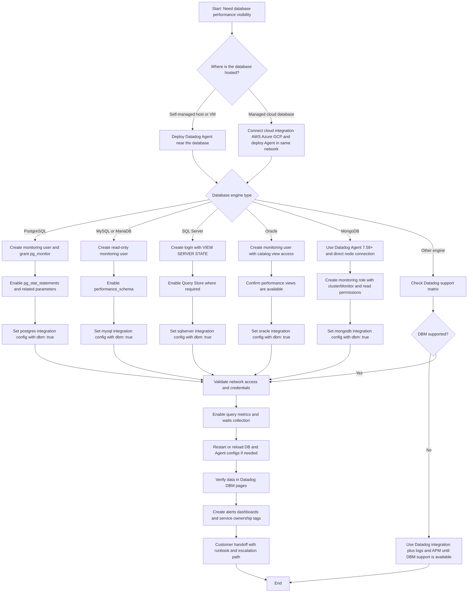

# Datadog Database Monitoring (DBM) Setup Flowchart

This guide provides a customer-friendly process flow for setting up Datadog DBM across common database types.

## End-to-end DBM setup flow

## What changes by database type

| Database type | Must-have telemetry feature | Typical minimum read-only access | Managed service note |
| --- | --- | --- | --- |
| PostgreSQL | `pg_stat_statements` | `pg_monitor` (or equivalent least-privilege grants) | On RDS/Aurora PostgreSQL, use parameter groups to enable extension settings. |
| MySQL/MariaDB | `performance_schema` | Read access to performance schema and status views | On RDS/Aurora MySQL, enable required parameters in DB parameter groups. |
| SQL Server | Query Store (recommended) | `VIEW SERVER STATE` and related read-only metadata access | On Azure SQL/Amazon RDS SQL Server, apply equivalent permissions and network access from Agent. |
| Oracle | Performance/catalog dynamic views | `CREATE SESSION` plus catalog performance view access | For managed Oracle services, map grants to provider-specific role capabilities. |
| MongoDB | DBM query and cluster metrics collection | `clusterMonitor` plus read access (`read` or `readAnyDatabase` depending on scope) | MongoDB Atlas DBM requires supported tiers (for example, M10+; shared/serverless tiers are not supported). |
| Other engines | Vendor-specific diagnostics | Least-privilege read-only monitoring role | If DBM is not supported, use integrations, logs, and APM traces first. |

## Customer-facing talk track (simple)

1. **Decide scope**: database type, environment, and business-critical services.
2. **Prepare security**: create a read-only monitoring user and store credentials securely.
3. **Enable telemetry**: turn on engine-specific performance features.
4. **Connect Datadog**: deploy Agent and set integration config with `dbm: true`.
5. **Validate**: confirm query performance, blocking or lock signals, waits (where applicable), and host metrics in DBM.
6. **Operationalize**: build dashboards, define alerts, and document support ownership.

## Suggested validation checklist

- DB host appears in Datadog Infrastructure.
- Database instance appears in Datadog Database Monitoring.
- Top queries show latency and execution volume.
- Wait events or lock analysis panels have data.
- Alerts trigger for high latency, saturation, and error spikes.
- Dashboard links are shared with customer stakeholders.
