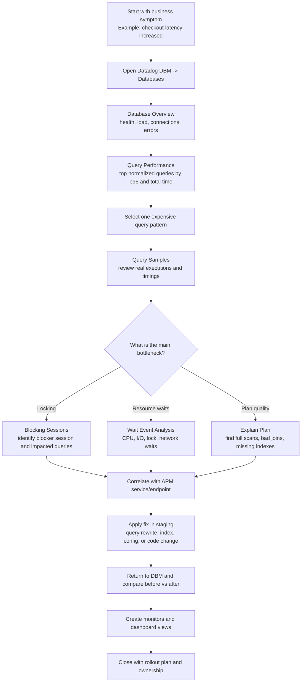
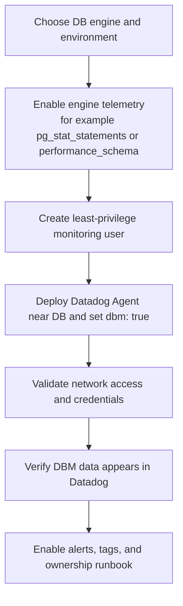

# Datadog DBM demonstration flowchart (with feature explanations)

Use this guide to run a clear customer demo of Datadog Database Monitoring (DBM).  
It is optimized for a 15-20 minute walkthrough and includes a short setup appendix.

## 1) Live demo flow (what to show in the Datadog UI)

## 2) Feature-by-feature explanation (what to say during demo)

| DBM feature | What it shows | Why it matters | Demo click path | Suggested talk track |
| --- | --- | --- | --- | --- |
| **Database Overview** | Throughput, active connections, errors, and high-level health for each instance. | Gives executives and SREs a quick "is the DB healthy?" answer. | `DBM -> Databases -> <instance>` | "This is the health snapshot we use to decide whether the database is likely part of the incident." |
| **Query Performance** | Aggregated metrics for normalized query patterns (latency, calls, rows, total time). | Identifies the small set of queries driving most load and latency. | `DBM -> Query Performance` | "Instead of guessing, we rank query patterns by impact and start with the highest-cost one." |
| **Query Samples** | Real executions for a query pattern with execution time context. | Helps prove whether one pattern is consistently slow or only spikes occasionally. | `Query Performance -> click a query -> Samples` | "Samples show concrete executions so we can separate occasional outliers from systematic slowness." |
| **Explain Plan** *(supported engines)* | Query execution plan details (scans, join strategy, estimated cost). | Turns "slow query" into an actionable fix (index, join order, predicate change). | `Query detail -> Explain Plan` | "The plan shows why it is slow; here we can justify adding an index or rewriting SQL." |
| **Wait Event Analysis** *(supported engines)* | Time spent waiting on CPU, locks, I/O, network, etc. | Distinguishes true query inefficiency from infrastructure or contention issues. | `DBM -> Waits / Query detail waits` | "If waits are mostly lock or I/O, optimization strategy changes immediately." |
| **Blocking Sessions / Lock Analysis** *(supported engines)* | Blocking trees and blocked sessions. | Speeds up incident response during lock storms and deadlock-like behavior. | `DBM -> Blocking` | "This pinpoints the blocker session so we can resolve impact quickly, not hunt manually." |
| **Correlation with APM and logs** | Direct path from DB signals to app services/endpoints and related traces/logs. | Connects database behavior to user-facing impact and ownership. | `DBM panel -> related APM service/trace/log` | "Now we can show which endpoint or deployment caused the database pressure." |
| **Monitors and dashboards** | Alerting on latency/waits/errors and trend views for operations. | Moves teams from reactive debugging to proactive detection. | `Monitors` and `Dashboards` | "After root cause, we codify guardrails so this issue is caught earlier next time." |

## 3) Suggested 15-minute demo script

1. **Minute 0-2**: state scenario and success criteria (for example, "checkout p95 < 300 ms").
2. **Minute 2-4**: open **Database Overview** to confirm abnormal load or errors.
3. **Minute 4-7**: use **Query Performance** to isolate top high-impact query patterns.
4. **Minute 7-9**: open **Query Samples** and **Explain Plan** for one candidate query.
5. **Minute 9-11**: check **Waits** and **Blocking Sessions** to verify root-cause category.
6. **Minute 11-13**: pivot to **APM correlation** and show affected endpoint/service.
7. **Minute 13-15**: show post-fix improvement and create monitor/dashboard guardrails.

## 4) Optional enablement flow (if audience asks "how is DBM turned on?")

### Engine prerequisites at a glance

| Database type | Key telemetry prerequisite | Typical minimum read-only access |
| --- | --- | --- |
| PostgreSQL | `pg_stat_statements` enabled | `pg_monitor` (or equivalent least-privilege grants) |
| MySQL/MariaDB | `performance_schema` enabled | Read access to performance schema and status views |
| SQL Server | Query Store recommended | `VIEW SERVER STATE` and related metadata access |
| Oracle | Performance/catalog dynamic views available | `CREATE SESSION` + catalog performance view access |
| MongoDB | Supported Agent/Atlas tier and DBM support | `clusterMonitor` + appropriate read role |

## 5) Validation checklist

- Database instance appears in Datadog DBM.
- Query Performance shows top normalized query patterns.
- At least one of waits or lock analysis panels has data (engine-dependent).
- You can pivot from DBM to the owning service in APM.
- Monitor for query latency/waits is created and linked to on-call ownership.
